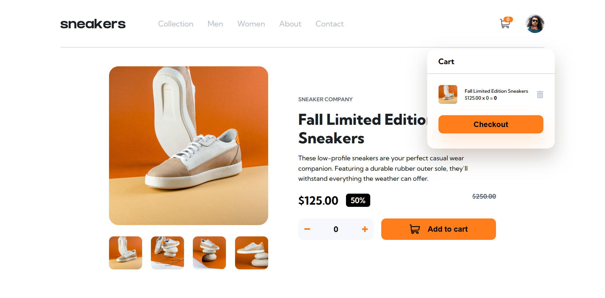

# Frontend Mentor - E-commerce product page solution

### The challenge

Users should be able to:

- View the optimal layout for the site depending on their device's screen size
- See hover states for all interactive elements on the page
- Open a lightbox gallery by clicking on the large product image
- Switch the large product image by clicking on the small thumbnail images
- Add items to the cart
- View the cart and remove items from it

### Screenshot

### Links

- Solution URL: [Add solution URL here](https://github.com/Jstickz/ecommerce-product-page-main)
- Live Site URL: [Add live site URL here](https://vercel.com/john-adeoyes-projects/ecommerce-product-page-main)

## My process
  I started this project with html and cssn and later coded the interaction with javascript.

### Built with

- Semantic HTML5 markup
- CSS custom properties
- Flexbox
- CSS Grid
- Mobile-first workflow

